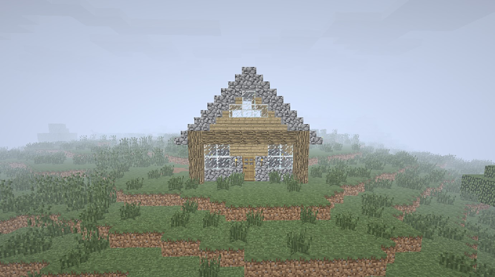
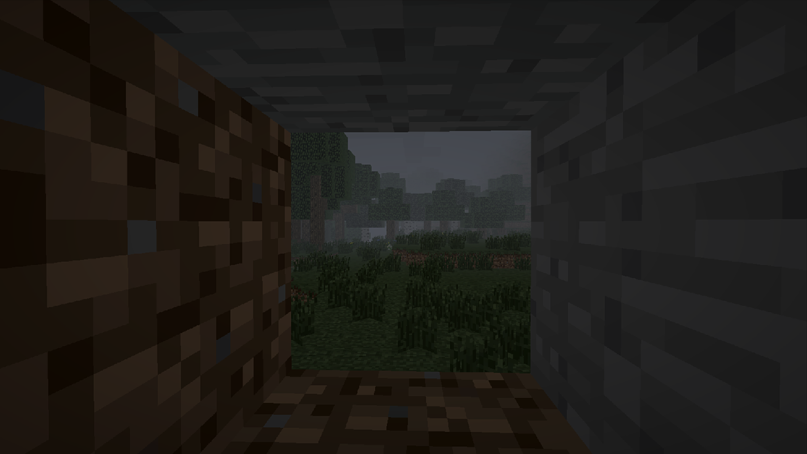
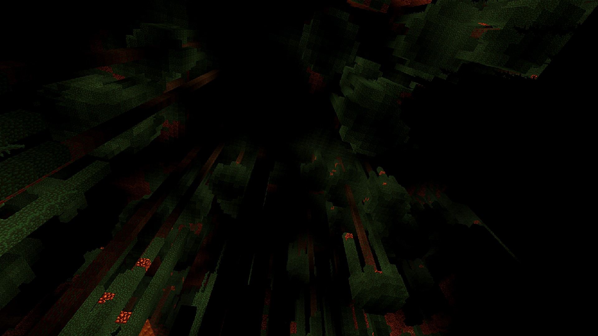

# Eerie (Modpack)

## Shouldn't it be calming to hear the birds chirp?

 

This modpack is meant to bring back the scariness and eerieness that old Minecraft had. It was originally inspired by [Alpha Oxtrot](https://www.youtube.com/watch?v=6h7J_PQdYXg), but has grown over the years into its own project.

This is listed as a terror modpack because that is primarily how it operates. There are no scary monsters added, just an unsettling atmosphere. Also, it should be noted that this is made for actual gameplay and not necessarily content creation.

Credits to [Crop XP](https://www.curseforge.com/minecraft/mc-mods/xp-from-crops-fabric) and many other mods for making this possible

 

### Check out the [Playthrough Readme](Playthrough_Readme.md)

 

This is (a partial copy of) the official copy of my modpack [Eerie](https://modrinth.com/modpack/eerie). This is where you can submit bug reports, give suggestions, etc.

Please note that this is under All Rights Reserved because I am very protective of what I've made here. It should also be noted that there may be contents in this repository that I do not have copyright ownership over, and I am not claiming to have any copyright ownership over anything that I have not made. The [license](LICENSE) covers items like the shaderpack, the edits in configuration files, the specific combination of mods used, the gallery of screenshots, and more. Also, if you own the copyright of anything in this repo and you want it to be removed from this, please let me know and I'll remove it right away.
